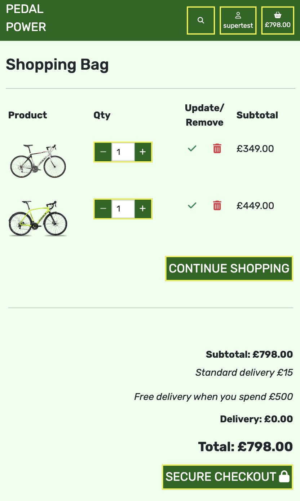
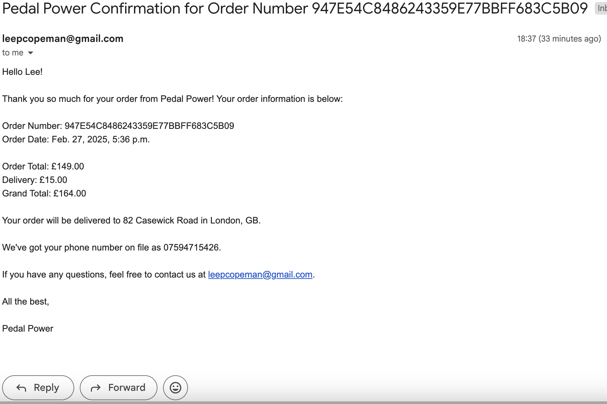

# Features

- Each page has a header and a footer

## Header 

Header has the following links:
- Home page - from logo:
    - Text has underline decoration when hovered over
- Account button:
    - Register
    - Login
    - Logout (if signed in)
    - My Profile (if signed in)
    - Product Management (if superuser) which leads to Add Product page
        - Account button text changes to yellow and background a differnt shade of green when hovered over

- Shopping bag, displaying the price of items in the bag
    - Text changes to yellow and background a differnt shade of green when hovered over
- Search bar
    - Colour of icon in search bar changes to yellow when hovered over

The simplistic design of the header is based on the decision to make the use of the website easy for the user.

When the app is viewed on smaller screens, the 'Account', 'Shopping basket', and 'Search' links are all smaller to make the header clean and all features remain on one line. The search bar is now hidden behind the search button, again to reduce space taken, and drops down when clicked.

When a user is logged in, their name replaces 'Account' on the Account button. This enhances usability, security, and engagement for the user.

---

## Footer

- Footer for large screens
    

- Footer for smaller screens
    

The footer has the following sections:
- Social media links
    
    * Social media links has hover properties
    * All links open the relevant pages in new windows

- About page link
    
    * `Click here!` has hover properties
    * Opens the about page

- Subscribe to newsletter
    
    * Valid email address can be entered to sign up to newsletter
    * Submit button has hover properties 

---

## Landing Page

A picture of a bike in a nature setting was chosen for the landing page to reinforce the idea of cycling as an environmentally friendly mode of transport. The natural backdrop highlights the sustainability of biking, aligning with eco-conscious values. Additionally, the image evokes a sense of adventure and freedom, inspiring users to explore the outdoors and embrace cycling as a lifestyle. This visual connection helps create an emotional appeal, making the website more engaging and relatable to visitors who appreciate both nature and sustainable travel.

The shop now button is clearly visible, enabling fluid UI.
The shop now button has hover properties.

## Products Page

Product cards wrap from 4 across on largest screens, 3 for large screens, 2 medium screens, and 1 for small screens.

Medium Screens Product Page

Small Screens Product Page

When a user is on the product page, a product header is visible. This shows the different categories available, helpings users to find what product they require. Categories headings have hover properties.

All products are shown as product cards. Each card has:
- Product name
- Image
- Price
- Category

When a product card is hovered over, the image size increases.

If a superuser is logged in, they will also have buttons for Edit and Delete. These buttons have hover properties.

---

## Product Detail Page

When a product card is clicked, the user is taken to the products detail page. This page has more details of the specefic product:
- Product name
- Image
- Description
- Colour
- Rating
- Price

Layout of product detail page for larger sccreens

Layout of product detail page for smaller screens

Each product has buttons to add the product to the shopping bag, including quantity. These buttons are clearly visible and have hover prooperties. There is also a button to take the user to the shopping bag page. 

At the bottom of the product detail page, users are shown a selection of similar items. Three similar items, which are in the same category as the product on the detail page, are shown in a carousel. The products change automatically, or there are buttons enabling the user to move throug the products. User on smart phones can also swipe through the products.

Below the similar products section, there is a continue shopping button, which will take the user back to the products page.

---

## Shopping Bag Page

If a user navigtes to the shopping bag when it is empty, a message indicating this is shown, along with a button so they can continue shopping. The continue shopping button has hover properties

Shopping bag layout for larger screens

Each product line has:
- Product name
- Price of individual item
- Quantity, with buttons to increaase/decrease
- Update quantity button - has hover properties, icon increases in size
- Delete item button - has hover properties, icon increases in size
- Subtotal

Shopping bag layout for small screens

Each product line has:
- Product image
- Quantity, with buttons to increaase/decrease
- Update quantity button - has hover properties, icon increases in size
- Delete item button - has hover properties, icon increases in size
- Subtotal

For all screensizes there is a continue shopping button, so users can add more items of they wish.

Below the summary of the shopping bag is the checkout section

The subtotal is shown, along with any delivering costs, depending on the amout spent, and the grand total. If the users wants to checkout, they are now able to click the secure checkout button.

---

## Checkout Page

Layout of the checkout page

At the top of the page the user is shown a summary of their order. There is a button to adjust bag, in case the user has made a mistake and wishes to change their bag. The summary includes:
- Item name
- Image
- Quantity
- Subtotals
- Delivery Cost
- Grand Total

The user has to complete the checkout form, which includes:
- Full name
- Email
- Phone Number
- Address
- Postcode
- Town or City
- County
- Country
- Card Details

When all checkout form has been completed the user can click complete order
- The total amount the user will be charged on their card is shown in red.

---

## Checkout Success Page

When the order has gone through successfully, the user is taken to the checkout success page. 

The page is titled with a thankyou message, and a note telling the user they will receive an email, sent to the users email

The order information is shown, including:

- Order Number
- Orer Date
- Order Status

- Order Items
- Price of Item

- Full name
- Email
- Phone Number
- Address
- Postcode
- Town or City
- County
- Country

- Order Totak
- Delivery Cost
- Grand Total

Below the order information the user is able to click the continue shopping button, directing them back to the products page.

---

## Confirmation Email

After an order has been placed, the user will receive an email with the order details.

- The email subject has `Pedal Power` followed by the order number

The body of the email contains:
- A personalised hello greeting, to the users name
- Thankyou message
- Order Number
- Order Date
- Delivery Address
- Users Email
- Sign off message from Pedal Power

---

## Profile Page

When a user is signed in, they will have their own profile page. This page will keep their personal information saved, enabling a quicker checkout process for any future orders. The profile page will also keep record of any past orders.

Profile page for larger screens

Profile page for small screens

Order history is summarised:
- Order number. Truncated to 6 characters, which is a link to the past order confirmation page
- Order date
- Items
- Order Total

If the user clicks of the order number to show the order confirmation, there is a back to profile button, so they can return to their profile page.

---

## About Page

Within the footer, users are able to click the link taking them to the about page. This page was created to give users information about Pedal Power.

About page layout for larger screens

About page layout for small screens

The page consists of:
- A description of the business, giving some background information.
- Address of the store
- Email address for store
- Telephone number 
- Mission statement 
- There is also a button directing users to the products page.
