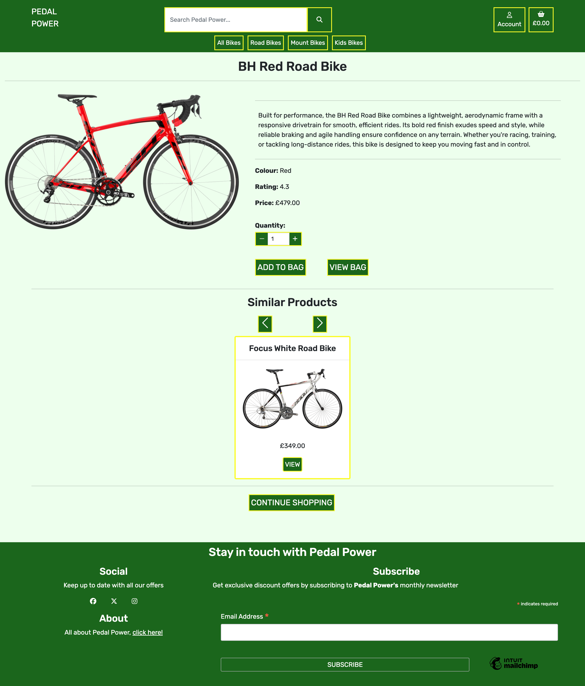

# Features

- Each page has a header and a footer

## Header 

Header has the following links:
- Home page - from logo:
    - Text has underline decoration when hovered over
- Account button:
    - Register
    - Login
    - Logout (if signed in)
    - My Profile (if signed in)
    - Product Management (if superuser) which leads to Add Product page
        - Account button text changes to yellow and background a differnt shade of green when hovered over

- Shopping basket
    - Text changes to yellow and background a differnt shade of green when hovered over
- Search bar
    - Colour of icon in search bar changes to yellow when hovered over

The simplistic design of the header is based on the decision to make the use of the website easy for the user.

When the app is viewed on smaller screens, the 'Account', 'Shopping basket', and 'Search' links are all smaller to make the header clean and all features remain on one line. The search bar is now hidden behind the search button, again to reduce space taken, and drops down when clicked.

When a user is logged in, their name replaces 'Account' on the Account button. This enhances usability, security, and engagement for the user.

---

## Footer

- Footer for large screens
    

- Footer for smaller screens
    

The footer has the following sections:
- Social media links
    
    * Social media links has hover properties
    * All links open the relevant pages in new windows

- About page link
    
    * `Click here!` has hover properties
    * Opens the about page

- Subscribe to newsletter
    
    * Valid email address can be entered to sign up to newsletter
    * Submit button has hover properties 

---

## Landing Page

A picture of a bike in a nature setting was chosen for the landing page to reinforce the idea of cycling as an environmentally friendly mode of transport. The natural backdrop highlights the sustainability of biking, aligning with eco-conscious values. Additionally, the image evokes a sense of adventure and freedom, inspiring users to explore the outdoors and embrace cycling as a lifestyle. This visual connection helps create an emotional appeal, making the website more engaging and relatable to visitors who appreciate both nature and sustainable travel.

The shop now button is clearly visible, enabling fluid UI.
The shop now button has hover properties.

## Products Page

Product cards wrap from 4 across on largest screens, 3 for large screens, 2 medium screens, and 1 for small screens.

Medium Screens Product Page

Small Screens Product Page

When a user is on the product page, a product header is visible. This shows the different categories available, helpings users to find what product they require. Categories headings have hover properties.

All products are shown as product cards. Each card has:
- Product name
- Image
- Price
- Category

When a product card is hovered over, the image size increases.

If a superuser is logged in, they will also have buttons for Edit and Delete. These buttons have hover properties.

---

## Product Detail Page

When a product card is clicked, the user is taken to the products detail page. This page has more details of the specefic product:
- Product name
- Image
- Description
- Colour
- Rating
- Price

Layout of product detail page for larger sccreens

Layout of product detail page for smaller screens

Each product has buttons to add the product to the shopping bag, including quantity. These buttons are clearly visible and have hover prooperties. There is also a button to take the user to the shopping bag page. 

At the bottom of the product detail page, users are shown a selection of similar items. Three similar items, which are in the same category as the product on the detail page, are shown in a carousel. The products change automatically, or there are buttons enabling the user to move throug the products. User on smart phones can also swipe through the products.

Below the similar products section, there is a continue shopping button, which will take the user back to the products page.

---

## Shopping Bag Page

If a user navigtes to the shopping bag when it is empty, a message indicating this is shown, along with a button so they can continue shopping. The continue shopping button has hover properties

