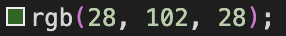
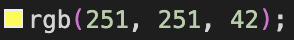
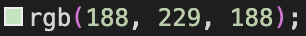
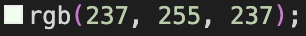
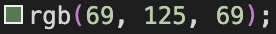

# Pedal Power

Live Version: [Pedal Power](https://pedal-power-store-be92afa30294.herokuapp.com/)

Repository: [GitHub Repo](https://github.com/l-copeman/bicycle-store)

The app is developed by [Lee Copeman](https://github.com/l-copeman).


## About

[Pedal Power](https://pedal-power-store-be92afa30294.herokuapp.com/) is a fully responsive e-commerce website, designed for cycling enthusiasts to browse and purchase a range of bicycle products. The project offers a real-world online store, offering features such as user authentication, a shopping cart, secure payments via Stripe, and an intuitive product management system.

This project was developed as part of a full-stack web development course, focusing on best practices for backend logic, database management, front-end UI, and deployment. The site allows both customers and admins to interact with the platform seamlessly, with CRUD functionality for products and order management.


## User Experience Design

### Strategy

Developed for users who are cooking in the household. The app is designed to be easy to use and intuitive. A selection of recipes are easily viewed, with a title, a short excerpt, the recipe author, servings per recipe and finally an image. An individual recipe can then by viewed, listing the ingredients required for the receipe, and easy to follow steps. As a final goal, the app allows users to leave comments regarding their experiences of the recipe.

### Target Audience

The website was developed for cyclists who are looking to purchase a bicycle. The nature of cycling allows this to have a great range in terms of target audience; from very young children to elderly.  
  * Young children looking for their first bike, whether it be a balance bike or with pedals.
  * Adults who require a bike for leisure
  * Enthusiasts who are looking for a higher spec bike 


### User Stories

#### **First Time Visitor Goals**

| Issue ID    | User Story |
|-------------|-------------|
|[#6](https://github.com/users/l-copeman/projects/5/views/1?pane=issue&itemId=95539892&issue=l-copeman%7Cbicycle-store%7C6)| As a First Time Visitor, I can view a list of products so that I can decide what I can purchase |
|[#10](https://github.com/users/l-copeman/projects/5/views/1?pane=issue&itemId=95639520&issue=l-copeman%7Cbicycle-store%7C10)|As a First Time Visitor, I can search for a product by name or description so that I can easily find a specific product I want to purchase.|
|[#7](https://github.com/users/l-copeman/projects/5/views/1?pane=issue&itemId=95540872&issue=l-copeman%7Cbicycle-store%7C7)|As a First Time Visitor, I can view individual product details so that I can determine the price and description.|
|[#11](https://github.com/users/l-copeman/projects/5/views/1?pane=issue&itemId=95642432&issue=l-copeman%7Cbicycle-store%7C11)|As a First Time Visitor, I can easily select the quantity and size of any product I want to purchase so that I don't accidentally select the wrong product, size or quantity.|
|[#14](https://github.com/users/l-copeman/projects/5/views/1?pane=issue&itemId=97050593&issue=l-copeman%7Cbicycle-store%7C14)|As a First Time Visitor, I can click different categories so that I can view products in these categories.|
|[#23](https://github.com/users/l-copeman/projects/5/views/1?pane=issue&itemId=97930853&issue=l-copeman%7Cbicycle-store%7C23)|As a First Time Visitor, I can see products similar to what I am currently viewing so that I can see more products I might be interested in.|
|[#8](https://github.com/users/l-copeman/projects/5/views/1?pane=issue&itemId=95541369&issue=l-copeman%7Cbicycle-store%7C8)|As a First Time Visitor, I can easily view the total of my purchases at any time so that keep track of what is being spent.|
|[#15](https://github.com/users/l-copeman/projects/5/views/1?pane=issue&itemId=97926369&issue=l-copeman%7Cbicycle-store%7C15)|As a First Time Visitor, I can change the quantity of items in my bag so that I can make changes before checkout.|
|[#16](https://github.com/users/l-copeman/projects/5/views/1?pane=issue&itemId=97926609&issue=l-copeman%7Cbicycle-store%7C16)|As a First Time Visitor, I can easily enter my payment details so that I can purchase items from the store.|
|[#17](https://github.com/users/l-copeman/projects/5/views/1?pane=issue&itemId=97926861&issue=l-copeman%7Cbicycle-store%7C17)|As a First Time Visitor, I can view confirmation of my order so that I can ensure no mistakes were made.|
|[#22](https://github.com/users/l-copeman/projects/5/views/1?pane=issue&itemId=97929633&issue=l-copeman%7Cbicycle-store%7C22)|As a site user I can view an about page so that I can learn about the store.|
|[#18](https://github.com/users/l-copeman/projects/5/views/1?pane=issue&itemId=97927156&issue=l-copeman%7Cbicycle-store%7C18)|As a site user I can receive an email of my order so that I can keep confirmation of the order.|

#### **Frequent Visitor Goals**

| Issue ID    | User Story |
|-------------|-------------|
|[#1](https://github.com/users/l-copeman/projects/5/views/1?pane=issue&itemId=95520839&issue=l-copeman%7Cbicycle-store%7C1)|As a Frequent User, I can easily register for an account so that I have a personal account and I can view my profile.|
|[#2](https://github.com/users/l-copeman/projects/5/views/1?pane=issue&itemId=95521596&issue=l-copeman%7Cbicycle-store%7C2)|As a Frequent User, I can easily login and logout so that I can access my personal account information.|
|[#5](https://github.com/users/l-copeman/projects/5/views/1?pane=issue&itemId=95536459&issue=l-copeman%7Cbicycle-store%7C5)|As a Frequent User, I can have a personalised user profile so that I can view my personal order history and order confirmations.|
|[#4](https://github.com/users/l-copeman/projects/5/views/1?pane=issue&itemId=95524076&issue=l-copeman%7Cbicycle-store%7C4)|As a Frequent User, I can receive an email after registering so that my account registration is verified.|
|[#3](https://github.com/users/l-copeman/projects/5/views/1?pane=issue&itemId=95522901&issue=l-copeman%7Cbicycle-store%7C3)|As a Frequent User, I can easily recover a lost password so that I can gain access to my account|
|[#24](https://github.com/users/l-copeman/projects/5/views/1?pane=issue&itemId=99384390&issue=l-copeman%7Cbicycle-store%7C24)|As a Frequent User, I can sign up for a monthly newsletter so that I can keep up to date with the company and any promotions.|
|[#25](https://github.com/users/l-copeman/projects/5?pane=issue&itemId=99384794&issue=l-copeman%7Cbicycle-store%7C25)|As a Frequent User, I can navigate to the Facebook page so that I can keep in contact with the company.|

#### **Site Admin**

| Issue ID    | User Story |
|-------------|-------------|
|[#19](https://github.com/users/l-copeman/projects/5/views/1?pane=issue&itemId=97927725&issue=l-copeman%7Cbicycle-store%7C19)|As Site Admin, I can add products to the site so that I can keep the products updated. |
|[#20](https://github.com/users/l-copeman/projects/5/views/1?pane=issue&itemId=97928501&issue=l-copeman%7Cbicycle-store%7C20)|As Site Admin, I can edit products so that products can be updated accordingly. |
|[#21](https://github.com/users/l-copeman/projects/5/views/1?pane=issue&itemId=97928897&issue=l-copeman%7Cbicycle-store%7C21)|As Site Admin, I can delete a product so that the site only shows products available for purchase. |

#### **Future Goals**

| Issue ID    | User Story |
|-------------|-------------|
|[#13](https://github.com/users/l-copeman/projects/5/views/1?pane=issue&itemId=95647712&issue=l-copeman%7Cbicycle-store%7C13)|As a Site User, I can leave a review after purchasing a product so that other users can view reviews before purchasing.|
|[#9](https://github.com/users/l-copeman/projects/5/views/1?pane=issue&itemId=95638558&issue=l-copeman%7Cbicycle-store%7C9)|As a site user I can easily identify deals and special offers so that I can benefit from the savings on these products.|

---

## MARKETING

Please refer to the [MARKETING.md](MARKETING.md) file for all marketing-related documentation.

---

## Technologies used

- ### Languages:
    
    + [Python 3.12.8](https://www.python.org/downloads/release/python-3127/): the primary language used to develop the server-side of the website.
    + [JS](https://www.javascript.com/): the primary language used to develop interactive components of the website.
    + [HTML](https://developer.mozilla.org/en-US/docs/Web/HTML): the markup language used to create the website.
    + [CSS](https://developer.mozilla.org/en-US/docs/Web/css): the styling language used to style the website.

- ### Frameworks and libraries:

    + [Django](https://www.djangoproject.com/): python framework used to create all the logic.
    + [Bootstrap 5.3](https://getbootstrap.com/docs/5.3/getting-started/introduction/): a front-end CSS framework library.

- ### Databases:

    + [PostgreSQL](https://www.postgresql.org/): the database used to store all the data.

- ### Other tools:

    + [GitPod](https://gitpod.io/): IDE used to develop the website.
    + [VSCode](https://code.visualstudio.com/): IDE also used to develop this website.
    + [Pip3](https://pypi.org/project/pip/): the package manager used to install the dependencies.
    + [Django-allauth](https://django-allauth.readthedocs.io/en/latest/): the authentication library used to create the user accounts.
    + [Django-crispy-forms](https://django-cryptography.readthedocs.io/en/latest/): was used to control the rendering behavior of Django forms.
    + [Heroku](https://id.heroku.com/): the cloud platform used to host the website.
    + [GitHub](https://github.com/): used to host the website's source code.
    + [Chrome DevTools](https://developer.chrome.com/docs/devtools/open/): was used to debug the website.
    + [Font Awesome](https://fontawesome.com/): was used to create the icons used in the website. 
    + [W3C Validator](https://validator.w3.org/): was used to validate HTML5 code for the website.
    + [W3C CSS validator](https://jigsaw.w3.org/css-validator/): was used to validate CSS code for the website.
    + [JShint](https://jshint.com/): was used to validate JS code for the website.
    + [PEP8](https://pep8ci.herokuapp.com/#): was used to validate Python code for the website.

---

## FEATURES

Please refer to the [FEATURES.md](FEATURES.md) file for all features-related documentation.

---

## Design

### Color Scheme

The chosen color scheme for the project predominantly features green, symbolizing nature, sustainability, and the eco-friendly benefits of cycling. This reinforces the idea that cycling is a clean, environmentally conscious mode of transport. Green evokes a sense of freshness and harmony, aligning with the project’s theme. Additionally, yellow accents are used throughout the design to create contrast and visual interest. Yellow is associated with energy, positivity, and movement, complementing the green while ensuring important elements stand out. The combination of these colors enhances readability, improves user experience, and reinforces the project’s environmental message.

- 
  - Was used for header and footer, as well as button styling
- 
  - Was used for borders
- 
  - Was used for message container
- 
  - Was used for the overlay for pages apart from landing page
- 
  - Was used for some hover effects and loading overlay


### Typography

The main font used in the application is Rubik. The font-family was chosen due to its readability, which increases user experience.

  

  

  


### Imagery

All images used throughout the site are from:

- https://www.cleanpng.com/


Images were converted to `webp` format with Convertio to reduce size and therefore increase load time to improve UX.

[Font Awesome](https://fontawesome.com/) was used for the icons in the app.


### Wireframes

Wireframes were used to give visual views of how the pages should display the information. These were a first draft, so some stylings and colors are not represented in the finished project.

- Mobile Phone layout for homepage. 
  - 
- Laptop layout for homepage. 
  - 
- Mobile Phone layout 
  - 
- Laptop layout for 
  - 

---

## Information Architecture

### Database

- The database used for the project is PostgreSQL.

### Entity-Relationship Diagrams


#### Allauth's User Model

| Name          | Field Type    | Validation |
| --------------|-------------- | ---------- |
| UserName      | CharField     | max_length=150, blank=False, null=True, unique=True    |
| Email         | EmailField    | max_length=50   |
| Password      | TextField     | min_length=8, blank=False, null=False    |


#### About Model

| Name          | Field Type    | Validation |
| --------------|-------------- | ---------- |
| name          | CharField     | max_length=100, blank=True, null=True    |
| mission       | TextField     | max_length=1000, blank-True, null=True   |
| description   | TextField     | max_length=2000, blank=True, null=True   |
| address       | CharField     | max_length=255, blank=True, null=True   |
| phone         | CharField     | max_length=20, blank=True, null=True   |
| email         | EmailField    | blank=True, null=True   |
| map-embed     | TextField     | blank=True, null=True   |


#### Order Model

| Name          | Field Type    | Validation |
| --------------|-------------- | ---------- |
| order_number  | CharField     | max_length=32, editable=False, null=False  |
| user_profile  | TextField     | on_delete=MODELS.SET_NULL, blank-True, null=True   | ForeignKey 
| full_name     | CharField     | max_length=100, blank=False, null=False   |
| phone_number  | CharField     | max_length=20, blank=False, null=False   |
| address       | TextField     | max_length=80, blank=False, null=False   |
| town_or_city  | CharField    | max_length=40, blank=False, null=False   |
| county        | CharField    | max_length=50, blank=True, null=True   |
| postcode      | CharField    | max_length=20, blank=True, null=True   |
| country       | CountryField  | blank_label='Country*', blank=False, null=False   |
| status        | CharField    | max_length=10, choices=OrderStatus.choices,   |
| | |  default=OrderStatus.PENDING  |
| date          | DateTimeField | auto_now_add=True  |
| delivery_cost | DecimalField  | max_digits=6, decimial_places=2, null=False, default=0   |
| order_total   | DecimalField  | max_digits=10, decimial_places=2, null=False, default=0   |
| grand_total   | DecimalField  | max_digits=10, decimial_places=2, null=False, default=0    |
| original_bag  | TextField     | null=False blank=False, default=''  |
| stripe_pid    | CharField    | max_length=254, blank=False, null=False, default=''  |
|   | **OrderStatus:** |   'PENDING'
|   |    |   'PAID'
|   |    |   'SHIPPED'
|   |    |   'DELIVERED'
|   |    |   'CANCELLED'


#### OrderLineItem Model

| Name          | Field Type    | Validation |
| --------------|-------------- | ---------- |
| order         | ForeignKey   | Order, blank=False, null=False, 
| |   | on_delete=models.CASCADE, relate_name='lineitems'    |
| product       | ForeignKey    | Product, null=False, blank=False, on_delete=models.CASCADE,   |
| quantity      | IntegerField   | null=False blank=False, default=0     |
| lineitem_total| DecimalField   | max_digits=6, decimial_places=2, |
| | | null=False blank=False, editable=False     |


#### Category Model

| Name          | Field Type    | Validation |
| --------------|-------------- | ---------- |
| name          | CharField    | max_length=250  |


#### Product Model

| Name          | Field Type    | Validation |
| --------------|-------------- | ---------- |
| category      | ForeignKey   | Category, blank=False, null=True, on_delete=models.SET_NULL | 
| sku           | CharField    | max_length=250, unique=True, blank=False, null=False   |
| name          | CharField    | max_length=250, unique=True, blank=False, null=False   |
| image         | CloudinaryField   | 'image', default='placeholder'    |
| description   | TextField   | max_length=3000, blank=False, null=False  |
| colour        | CharField| max_length=30, null=False blank=False,  |
| price   | DecimalField   | max_digits=6, decimal_places=2, blank=False, null=False  |
| rating        | DecimalField  | max_digits=3, decimal_places, blank=False, null=False, |
| | | validators=[MinValueValidator(0), MaxValueValidator(5)] |


#### Profile Model

| Name          | Field Type    | Validation |
| --------------|-------------- | ---------- |
| user          | OneToOneField | User, on_delete=models.CASCADE | 
| default_phone_number   | CharField    | max_length=20, null=True, blank=True |
| default_address     | CharField    | max_length=40, null=True, blank=True  |
| default_town_or_city  | CharField   | 'image', default='placeholder'    |
| default_county   | CharField   | max_length=80, null=True, blank=True |
| default_postcode | CharField| max_length=30, null=False blank=False,  |
| default_country   | CountryField   | blank_label='Country', null=True, blank=True |

---
## Testing

Please refer to the [TESTING.md](TESTING.md) file for all test-related documentation.

---

## Deployment


- The app was deployed to [Heroku](https://id.heroku.com/).
- The app can be reached by the [link](https://pedal-power-store-be92afa30294.herokuapp.com/).

## Heroku Deployment

- Set up a local workspace on your computer for Heroku:
    - Create a list of requirements that the project needs to run:
      - type this in the terminal: `pip3 freeze > requirements.txt`
    - Commit and push the changes to GitHub
    
- Go to [www.heroku.com](www.heroku.com) 
- Log in or create a Heroku account.
- Create a new app with any unique name <name app>
- Create a Procfile in your local workplace:
    
    This file will will contain the following:
    ```python
        web: gunicorn <name app>.wsgi:application
    ```
- Commit and push the changes to GitHub.
- Go to resources in Heroku and search for postgresql. Select Hobby dev - Free and click on the provision button to add it to the project.
- Go to the settings app in Heroku and go to Config Vars
- Click on Reveal Config Vars and add the following config variables:

| Key      | Value          |
|-------------|-------------|
| DATABASE_URL | ... | 
| DISABLE_COLLECTSTATIC | 1 |
| SECRET_KEY | ... |
| CLOUDINARY_URL | ... |
| EMAIL_HOST_PASS | ... |
| EMAIL_HOST_USER | ... |
| STRIPE_PUBLIC_KEY | ... |
| STRIPE_SECRET_KEY | ... |
| STRIPE_WH_SECRET | ... |


- Copy the value of DATABASE_URL and input it into the .env file and generate a secret key (you may use [Djecrety](https://djecrety.ir/) for secret key generation).
- Migrate changes.
- Set debug to False in settings.py
- Commit and push the changes to GitHub.
- Connect your repository to Heroku.
- Deploy the app to Heroku by clicking "Deploy Branch" button. If you want to enable auto-deployment, click "Enable Automatic Deployment".
- The deployment process will start.
- Once deployed, the app can be opened!

**Final Deployment**

* Set debug to False locally + delete DISABLE_COLLECTSTATIC from config vars in Heroku dashboard.
* Commit and push the changes to GitHub.


---

## Credits

- [GitHub](https://github.com/) for giving the idea of the project's design.
- [Django](https://www.djangoproject.com/) for the framework.
- [Font awesome](https://fontawesome.com/): for the free access to icons.
- [Heroku](https://www.heroku.com/): for the free hosting of the website.
- [Icons8](https://icons8.com/): for providing free access to amazing icons and illustrations.
- [Postgresql](https://www.postgresql.org/): for providing a free database.
- [Responsive Viewer](https://chrome.google.com/webstore/detail/responsive-viewer/inmopeiepgfljkpkidclfgbgbmfcennb/related?hl=en): for providing a free platform to test website responsiveness
- [Favicon Generator. For real.](https://realfavicongenerator.net/): for providing a free platform to generate favicons.

---

## Acknowledgments

- Code Institute community and my mentor, Juliia Konovalova for their support and guidance through the project.
- My partner, Cristina Bonilla, for her continued support enabling me to complete this project.

