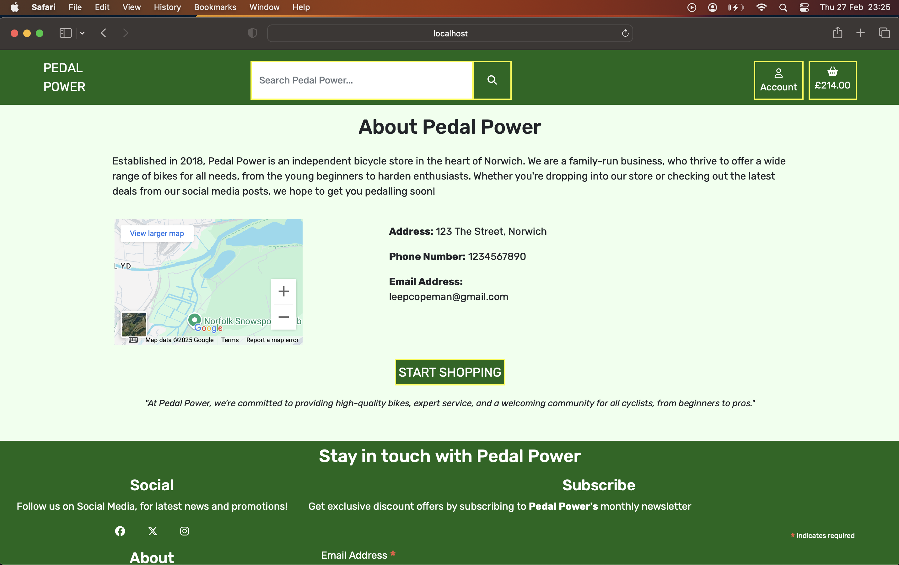
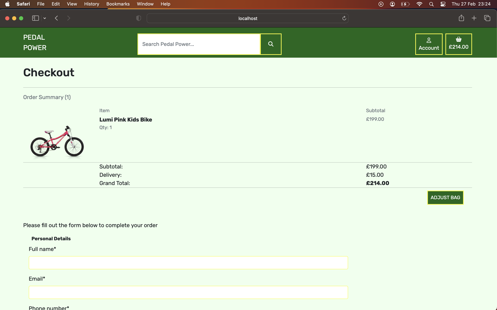

# Testing

## Manual Testing

Testing was done throughout site development, for each feature before it was merged into the master file.

Usability was tested with the below user acceptance testing, sent to new users to ensure testing from different users, on different devices and browsers to ensure issues were caught and where possible fixed during development.

|     | User Actions           | Expected Results | Y/N | Comments    |
|-------------|------------------------|------------------|------|-------------|
| **Header**    |                        |                  |      |             |
| 1           | Click on logo | Home page loads | Y | Hover properties          |
| 2           | Click on Account button | Account dropdown | Y | Hover properties          |
| 3          | Click on Login  | Login page loads | Y |          |
| 4           | Click on Registration | Registration page loads | Y |         |
| 5           | Click on  My Profile | Profile page loads | Y | User must be logged in        |
| 6            | Click on Product Management | Product Management page loads | Y | Superuser must logged in |
| 7     |   Click on Logout | Logout page loads | Y | User must be logged in    |
| 8         | User logged in status | User name shows on Account Button | Y | User must be logged in    |
|   9    |   Click on Search Logo  | Search bar appears  |   Y   | Search logo only visible on small screens    |
|   10    |   Click on Shopping Bag Logo | Shopping Bag Page loads    |   Y   | Hover properties |
| 11    | User searches an empty field  |   Message displayed   |   Y   |
| 12    | No matches for users search   | Message displayed |   Y   |
| **Footer**    |                        |                  |      |             |
| 1           | Click on Facebook link | Opens page in new window | Y | Hover properties         |
| 2           | Click on X link | Opens page in new window | Y | Hover properties         |
| 3           | Click on Instagram link | Opens page in new window | Y | Hover properties         |
| 4           | Click on About page link | About page loads | Y | Hover properties         |
|   5    |   Click Subscribe |   User subscribes to newsletter    |   Y   |   Valid email address must be entered |
| **Register Page**     |                        |                  |      |             |
| 1           | Click on sign in | Log in page loads | Y | If user already has an account they can log in         | 
| 2           | Enter valid username | Username accepted | Y |          |
| 3           | Enter username that already exists | Validation message | Y |          |
| 4           | Enter valid password | Password accepted | Y |          |
| 5           | Enter password too short |  Validation message | Y |          |
| 6           | Enter entirely numeric password  |  Validation message | Y | '12345678' used for test         |
| 7           | Enter password incorrectly second time |  Validation message | Y |          |
| 8           | Click Sign Up |  Account Created | Y | Log in message displayed        |
| **Log In Page**     |                        |                  |      |             |
| 1      | Click on sign up | Register page loads | Y | If user doesnt have an account they can sign up         | 
| 2           | Enter log in credentials | User logged in | Y | Log in message displayed         |
| 3           | Enter log in credentials incorecctly | Validation message | Y |          |
| 4           | Click Sign In | User signed in | Y | Log in message displayed         |
| **Sign Out Page**     |                        |                  |      |             |
| 1           | Click on sign out | User signed out | Y |  Sign out messge displayed        | 
| 2           | Click on cancel | User not signed out | Y |         | 
| **Home Page**     |                        |                  |      |             |
| 1    | Click on Shop Now button | Product page loads | Y | Hover properties button         | 
| **Products Page**     |                        |                  |      |             |
| 1           | Click on individual product   | Product Detail page loads | Y | Hover properties         | 
|**Product Detail Page**|   |   |   |   |
| 1           |  Click on image  | Enlarge image loads in new page  | Y |         | 
| 2           | Quantity + clicked   | Quantity increases by 1 | Y |        | 
| 3           | Quantity - clicked   | Quantity decreases by 1 | Y |         |
| 4           | Click Add to Bag   | Item added to bag | Y | Message displayed       | 
| 5           | Click View Bag   | Shopping bag loads | Y | Hover properties        | 
| 6           | < Button clicked   | Previous item shown in carousel | Y | Hover properties        | 
| 7          | > Button clicked   | Next item shown in carousel | Y | Hover properties         | 
| 8          | Click View   | Product detail page shown for item in carousel | Y | Hover properties         | 
| 9           | Click Continue Shopping   | Products page loads | Y | Hover properties       | 
|**Shopping Bag Page**|     |   |   |   |
| 1           | Quantity + clicked   | Quantity increases by 1 | Y |        | 
| 2           | Quantity - clicked   | Quantity decreases by 1 | Y |         |
| 3           |  Click update icon  | Quantity updates  | Y |  Quantity must have been changed with +/-  | 
| 4           | Click delete icon   | Item removed from bag | Y |   Message displayed     | 
| 5           | Click Continue Shopping   | Products page loads | Y | Hover properties       | 
| 6           | Click Secure Checkout   | Checkout page loads | Y |   Hover properties      |
|**Checkout Page**| 
| 1           | Adjust bag clicked   |Shopping bag page loads | Y |        | 
| 2           | Name not entered   | Form not accepted | Y | Validation message shown      |
| 3           | Email not entered  | Form not accepted  | Y |  Validation message shown  | 
| 4           | Address not entered   | Form not accepted | Y |   Validation message shown     | 
| 5           | Phone number not entered   | Form not accepted | Y | Validation message shown       | 
| 6           | Town or City  not entered   | Form not accepted | Y |  Validation message shown    |
| 7           | Country not entered  | Form not accepted  | Y | Validation message shown  | 
| 8           | Valid card not entered   | Form not accepted | Y |  Validation message shown    | 
| 9           | Complete order clicked   | Checkout success page loads | Y | Form completed       | 
|**Checkout success Page**| 
| 1           | Click Continue Shopping   | Product page loads | Y |  Hover properties      | 
|**About Page**| 
| 1           | Click - on map   | Map zooms out | Y |     | 
|   2   | Click + on map    | Map zooms in  | Y |   |
|   3   |   Click View larger map   | Larger map shown  |   Y   | Google Maps loads in a new window |
| 4 |   Click Start Shopping    |   Product page loads  |   Y   |   |
|**Profile Page**| 
| 1           | Click update information   | Information saved to profile | Y |     | 
|   2   | Click on previous order number    | Order confirmation is shown  | Y | Message displayed  |
|**Add Product Page**|
| 1 |   SKU not entered | Form not accepted | Y |   Validation message shown    |
|   2   |   Name not entered | Form not accepted    | Y |   Validation message shown        |
|   3   | Description not entered   |   Form not accepted   |   Y   |   Validation message shown |
| 4 |   Colour not entered  |   Form not accepted   |   Y   |   Validation message shown |
| 5  |   Price not entered   |   Form not accepted   | Y |   Validation message shown   |
|   6   |   Rating not entered  |   Form not accepted   |   Y   |   Validation message shown |
| 7 | Non-numerical chars entered for price |   Form not accepted | Y   |   Validation message shown |
|   8   | Rating above 5 entered    |   Form not accepted |  Y   |   Validation message shown |
| 9 |   Add Product clicked | Product added |   Y   |   Form entered with valid data    |
| **Edit Product Page** |
| 1 |   SKU not entered | Form not accepted | Y |   Validation message shown |
|   2   |   Name not entered | Form not accepted    | Y |   Validation message shown    |
|   3   | Description not entered   |   Form not accepted   |   Y   |   Validation message shown |
| 4 |   Colour not entered  |   Form not accepted   |   Y   |   Validation message shown |
| 5  |   Price not entered   |   Form not accepted   | Y |   Validation message shown |
|   6   |   Rating not entered  |   Form not accepted   |   Y   |   Validation message shown |
| 7 | Non-numerical chars entered for price |   Form not accepted | Y   |   Validation message shown |
|   8   | Rating above 5 entered    |   Form not accepted |  Y   |   Validation message shown |
| 9 |   Edit Product clicked | Product edited |   Y   |   Form entered with valid data  |
| 10 | Cancel clicked   |   Product page loads  | Y |   |

---

## Testing User Stories

| First Time Visitor Goals | Requirement met | Image |
| ------------------------- | --------------- | ----- |
| As a First Time Visitor, I can view a list of products so that I can decide what I can purchase. | After Shop Now button is clicked, the use is taken to the products page where all products are shown |  |
| As a First Time Visitor, I can search for a product by name or description so that I can easily find a specific product I want to purchase. | Search bar is in the header section, so always visible no matter what page the user is on |  |
| As a First Time Visitor, I can view individual product details so that I can determine the price and description. | When a product card is clicked the user is taken to the product detail page |  |
| As a First Time Visitor, I can easily select the quantity and size of any product I want to purchase so that I don't accidentally select the wrong product, size or quantity.| Quantity can be selected before adding an item to bag and also adjusted when in the shopping bag   |   |
| As a First Time Visitor, I can click different categories so that I can view products in these categories. | Category header is visible when viewing product page and product detail pages. |     |
| As a First Time Visitor, I can see products similar to what I am currently viewing so that I can see more products I might be interested in. | When viewing a product detail page, similar products are shown in a carousel |    |
| As a First Time Visitor, I can easily view the total of my purchases at any time so that keep track of what is being spent. | The shopping bag total is always shown in the shopping bag button in the header. |   |
| As a First Time Visitor, I can change the quantity of items in my bag so that I can make changes before checkout.| The quantity of an item can be updated whilst in the shopping bag. |  |
| As a First Time Visitor, I can easily enter my payment details so that I can purchase items from the store.| Payment details can be entered into the checkout form to complete order. |   |
| As a First Time Visitor, I can view confirmation of my order so that I can ensure no mistakes were made.| The order is summarised on the checkout page, and can be adjusted before payment is made. |   |
| As a site user I can view an about page so that I can learn about the store.| There is a link to the about page in the footer, with information regarding Pedal Power.|  |
| As a site user I can receive an email of my order so that I can keep confirmation of the order.| Users receive an email of the order to the email address entered at checkout. |  |

---

| Frequent Visitor Goals | Requirement met | Image |
| ------------------------- | --------------- | ----- |
| As a Frequent User, I can easily register for an account so that I have a personal account and I can view my profile.| There is a link to register for an account in the header section. |   |
| As a Frequent User, I can easily login and logout so that I can access my personal account information.| Login and logout links are both within the account button in the header.|  |
| As a Frequent User, I can have a personalised user profile so that I can view my personal order history and order confirmations.| After registering, a user has a profile page. There information can be saved there for future orders, and past order information is shown.|  |
| As a Frequent User, I can receive an email after registering so that my account registration is verified.| Users receive an email, to the email given in registration to confirm there email.|  |
| As a Frequent User, I can easily recover a lost password so that I can gain access to my account| If a valid email address is entered, the user will receive an email with a link to reset there password.|  |
| As a Frequent User, I can sign up for a monthly newsletter so that I can keep up to date with the company and any promotions.| There is a sign up in the footer to a monthly newsletter with Mailchimp. |  |
| As a Frequent User, I can navigate to the Facebook page so that I can keep in contact with the company.| Links to all social media sites are in the footer, so always visible. |  |

---

| Site Admin Goals | Requirement met | Image |
| ------------------------- | --------------- | ----- |
| As Site Admin, I can add products to the site so that I can keep the products updated. | There is a product mangement link in the account section for site admin to add products from the front end. Products can also be added in the admin panel. |  |
| As Site Admin, I can edit products so that products can be updated accordingly. | There are links to edit a product on the product page and product detail page. Products can also be edited in the admin panel. |  |
| As Site Admin, I can delete a product so that the site only shows products available for purchase.| There are links to delete a product on the product page and product detail page. Products can also be deleted in the admin panel. |  |

---

## Bugs

### Known Bugs

- I have used a yellow border to highlight different elements throughout the project. Although the yellow border for the country dropdown box in the checkout form, wraps around the title aswell as the dropdown box, where it should only be bordering the dropdown box.
- When editing a product, the current image does not show.

### Resolved Bugs

- The shopping bag was adding the standard delivery cost to the total, even when there were no products in the shopping bag. So a total of £15 was shown, when users first enter the site. 

To resolve this a simple if statement was added, so the delivery cost is 0, if the total is also 0.

- After updating the templates from allauth so they matched the project, the login and logout process stopped working correctly. After close inspection I discovered that the `` tag hadnt been loaded into the updated template. After adding this, it in enabled translation in templates and alluth worked correctly again.

---

## Validation

### HTML Validation:

- [index.html Validation Report](documentation/validation/index-html.png)

    - No errors or warnings were found when passing through the official [W3C](https://validator.w3.org/) validator. This checking was done manually by copying the view page source code and pasting it into the validator.

- [recipe_feature.html Validation Report](documentation/validation/feature-html.png)

    - No errors or warnings were found when passing through the official [W3C](https://validator.w3.org/) validator. This checking was done manually by copying the view page source code and pasting it into the validator.

### CSS Validation:

- [Full CSS Validation Report](documentation/validation/css.png)

- No errors or warnings were found when passing through the official [W3C (Jigsaw)](https://jigsaw.w3.org/css-validator/#validate_by_uri) validator. This checking was done manually by copying the view page source code and pasting it into the validator.

### JS Validation:

- [Full JS Validation Report](documentation/validation/js.png)

- No errors or warning messages were found when passing through the official [JSHint](https://www.jshint.com/) validator. However, the variable "Stripe" was showing as undefined. This was taken from Stripe documentation.

### Python Validation:

- [About App Model](documentation/validation/about-model.png)
    - No errors were found when the code was passed through Code Institutes pep8 validator [pep8 validator](). The checking was done manually by copying python code and pasting it into the validator.
- [About App URLS](documentation/validation/about.urls.png)
    - No errors were found when the code was passed through Code Institutes pep8 validator [pep8 validator](). The checking was done manually by copying python code and pasting it into the validator.    
- [About App Views](documentation/validation/about-views.png)
    - No errors were found when the code was passed through Code Institutes pep8 validator [pep8 validator](). The checking was done manually by copying python code and pasting it into the validator.
- [Bag App Views](documentation/validation/bag-view.png)
    - No errors were found when the code was passed through Code Institutes pep8 validator [pep8 validator](). The checking was done manually by copying python code and pasting it into the validator.   
- [Bag App Contexts](documentation/validation/bag-context.png)
    - No errors were found when the code was passed through Code Institutes pep8 validator [pep8 validator](). The checking was done manually by copying python code and pasting it into the validator.    
- [Bag App URLS](documentation/validation/bag-urls.png)
    - No errors were found when the code was passed through Code Institutes pep8 validator [pep8 validator](). The checking was done manually by copying python code and pasting it into the validator.
- [About App Views](documentation/validation/about-views.png)
    - No errors were found when the code was passed through Code Institutes pep8 validator [pep8 validator](). The checking was done manually by copying python code and pasting it into the validator.    
- [Checkout App Views](documentation/validation/check-views.png)
    - No errors were found when the code was passed through Code Institutes pep8 validator [pep8 validator](). The checking was done manually by copying python code and pasting it into the validator.             
- [Checkout App Admin](documentation/validation/check-admin.png)
    - No errors were found when the code was passed through Code Institutes pep8 validator [pep8 validator](). The checking was done manually by copying python code and pasting it into the validator.                 
- [Checkout App Forms](documentation/validation/check-form.png)
    - No errors were found when the code was passed through Code Institutes pep8 validator [pep8 validator](). The checking was done manually by copying python code and pasting it into the validator.    
- [Checkout App Signals](documentation/validation/check-signals.png)
    - No errors were found when the code was passed through Code Institutes pep8 validator [pep8 validator](). The checking was done manually by copying python code and pasting it into the validator.                 
- [Checkout App URLS](documentation/validation/check-urls.png)
    - No errors were found when the code was passed through Code Institutes pep8 validator [pep8 validator](). The checking was done manually by copying python code and pasting it into the validator.   
- [Checkout App Models](documentation/validation/checkout-model.png)
    - No errors were found when the code was passed through Code Institutes pep8 validator [pep8 validator](). The checking was done manually by copying python code and pasting it into the validator. 
- [Checkout App Webhooks](documentation/validation/webhooks.png)
    - No errors were found when the code was passed through Code Institutes pep8 validator [pep8 validator](). The checking was done manually by copying python code and pasting it into the validator.  
- [Checkout App Webhook Handler](documentation/validation/web-handler.png)
    - No errors were found when the code was passed through Code Institutes pep8 validator [pep8 validator](). The checking was done manually by copying python code and pasting it into the validator.       
- [Product App Admin](documentation/validation/prod-admin.png)
    - No errors were found when the code was passed through Code Institutes pep8 validator [pep8 validator](). The checking was done manually by copying python code and pasting it into the validator.                
- [Product App Form](documentation/validation/prod-admin.png)
    - No errors were found when the code was passed through Code Institutes pep8 validator [pep8 validator](). The checking was done manually by copying python code and pasting it into the validator.
- [Product App Model](documentation/validation/prod-model.png)
    - No errors were found when the code was passed through Code Institutes pep8 validator [pep8 validator](). The checking was done manually by copying python code and pasting it into the validator.                               
- [Product App URLS](documentation/validation/prod-urls.png)
    - No errors were found when the code was passed through Code Institutes pep8 validator [pep8 validator](). The checking was done manually by copying python code and pasting it into the validator.
- [Product App Views](documentation/validation/prod-views.png)
    - No errors were found when the code was passed through Code Institutes pep8 validator [pep8 validator](). The checking was done manually by copying python code and pasting it into the validator.
- [Profile App Views](documentation/validation/profile-views.png)
    - No errors were found when the code was passed through Code Institutes pep8 validator [pep8 validator](). The checking was done manually by copying python code and pasting it into the validator.
- [Profile App URLS](documentation/validation/profile-urls.png)
    - No errors were found when the code was passed through Code Institutes pep8 validator [pep8 validator](). The checking was done manually by copying python code and pasting it into the validator.    
- [Profile App Models](documentation/validation/profile-models.png)
    - No errors were found when the code was passed through Code Institutes pep8 validator [pep8 validator](). The checking was done manually by copying python code and pasting it into the validator. 
- [Profile App Forms](documentation/validation/profile-form.png)
    - No errors were found when the code was passed through Code Institutes pep8 validator [pep8 validator](). The checking was done manually by copying python code and pasting it into the validator.             

---

## Lighthouse Report

---

## Responsiveness

The responsiveness was checked manually by using devtools (Chrome) throughout the whole development. It was also checked with [Responsive Viewer](https://chrome.google.com/webstore/detail/responsive-viewer/inmopeiepgfljkpkidclfgbgbmfcennb/related?hl=en) Chrome extension.

### Home Page

#### Mobile Screens

#### Tablet Screens

#### Large Screens

---

### Product Page

#### Mobile Screen

#### Tablet Screen

#### Large Screen

---

### Product Detail Page

#### Mobile Screen

#### Tablet Screen

#### Laptop Screen

---

## Compatability

Thorough testinfg has been carried out on the following browsers:
- Chrome
- Firefox
- Safari

